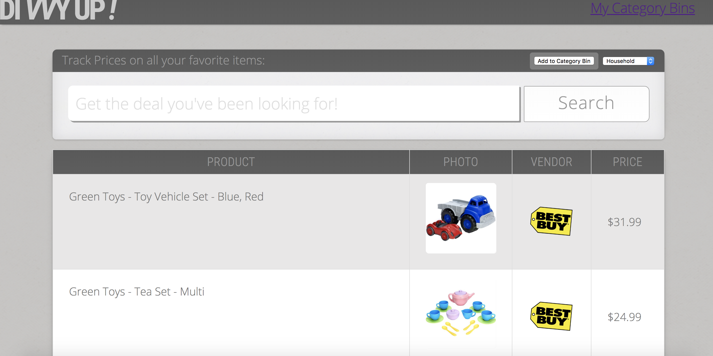

# Divvy Up

* A price-checker user interactive application which displays product description and price based on User Search.

* Prices are sourced from two specific retailers and displayed on the search page.

* User can add products to default category bins or customized category bins based on user preference.

* The ‘Divvy UP’ application is built on user ease to view price of products they prefer having a price check on.

* User can choose ‘My Category Bins’ to directly check the current price details of his saved preferences.

* Build an application with a free search on two retailers API displaying similar results of products matching user search.

* Application should allow the user to choose the applicable ‘Category’ under which products can be saved.

* ‘Category Bin’ should allow the user to view the current price of the previously saved products.

